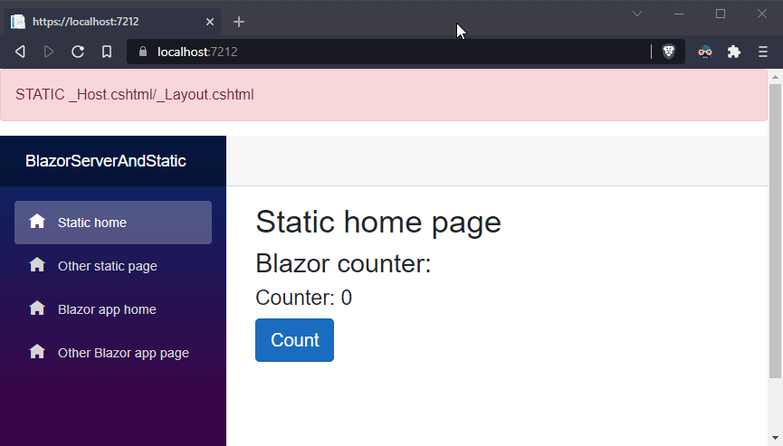

# Blazor server side + static pages
This repo demonstrates how you can make a blazor app that servers both static pages (without the Blazor framework .js loaded) and Blazor server side pages.


[Explanation](#user-content-demo)

## Why
I wanted to make a Blazor server side app that also has a static landing page. Blazor (server side) isn't the most efficient thing ever built, and websocket connections come at a premium. This helps handle loads of traffic on a landing page/static pages and save on needlessly rendering static pages on the server.

This example demonstrates a front page that renders as static HTML without the blazor framework, but still using .razor pages and shared components.

Obviously the components will lack any interactivity, but that's not the point.

## How

By having two multiple `_Layout.cshtml` and `_Host.cshtml` pages (one for static, one for Blazor server) we can render a page without the Blazor framework on one, and with on the other.

In the static `Pages/Static/_Host.cshtml` we set the render-mode to `Static`:
```html
@page "/"
@namespace BlazorServerAndStatic.Pages.Static
@addTagHelper *, Microsoft.AspNetCore.Mvc.TagHelpers
@{
	Layout = "_LayoutStatic";
}

<component type="typeof(App)" render-mode="Static"/>
```

In our `Pages/Blazor/_Host.cshtml` page we want to set the render-mode to `ServerPrerendered`:
```html
@page "/app"
@namespace BlazorServerAndStatic.Pages.Blazor
@addTagHelper *, Microsoft.AspNetCore.Mvc.TagHelpers
@{
	Layout = "_Layout";
}

<component type="typeof(App)" render-mode="ServerPrerendered"/>
```

In `Program.cs` we can tell what `_Host.cshtml` page to use as entrypoint using fallbacks.  
In this example, any URL starting with `/app/` will use the Blazor framework as entrypoint.  
Any other URL will use the static entrypoint.
```csharp
app.MapFallbackToPage("/app/{*url}", "/Blazor/_Host");
app.MapFallbackToPage("/Static/_HostStatic");
```

That way, any page we don't put behind the `/app/` url prefix will not load the Blazor framework or set up a websocket connection.

## Demo

All pages have a counter component on them. When you enter the site through the urls `/` or `/otherstaticpage` the counter component will not work. Switching between these URLs results in a full page request/load like any other web app.

As soon as the user hits `/app` or `/app/otherblazorpage`, again a full page load occurs, but this time using the `/Pages/Blazor/_Host.cshtml`, which causes the Blazor framework to load.

From this point on, navigating on-page to any other page will happen using the websocket. Now, the counter on the "static" pages will work as well, because the user is now routing/browsing though the Blazor framework.